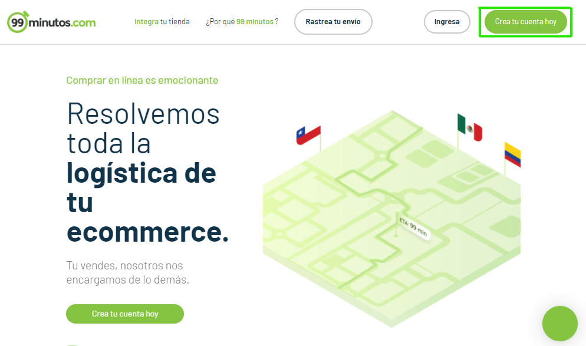
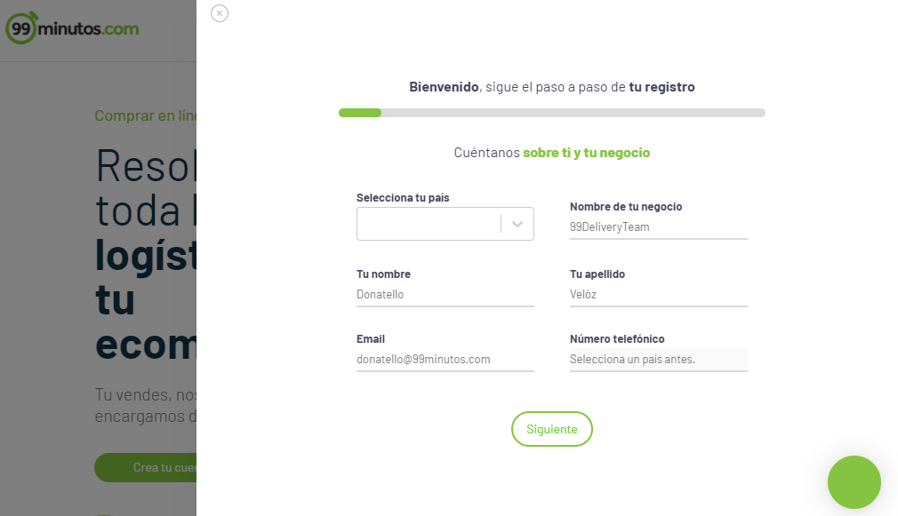
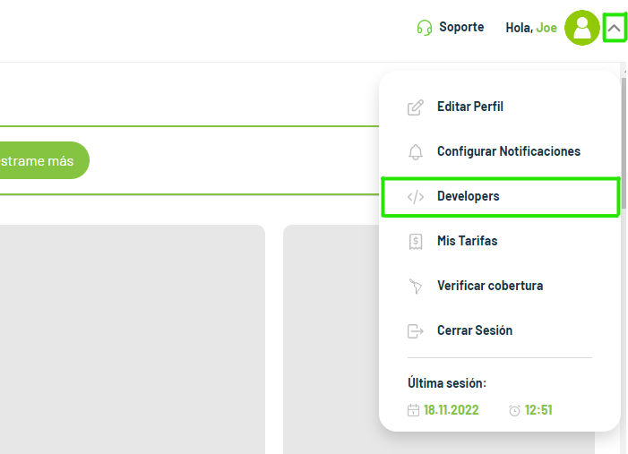
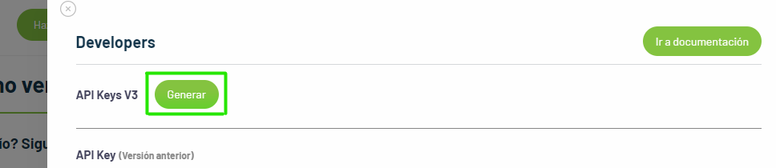
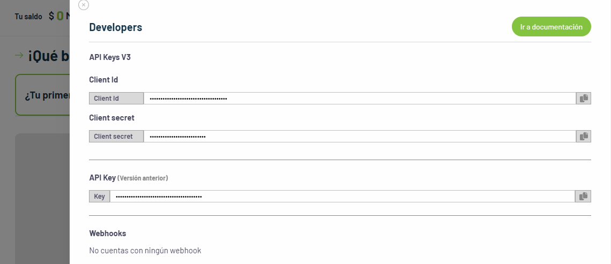

# API 99minutos - PHP cURL

---

This is a small repository which will help you to use the Delivery **99minutes API**. The main idea is to show you an example of its simple use and general queries to be able to use the **API** as comfortable as possible, mainly we will use **PHP cURL** to make the **API** queries.

If you want more information about the API you can check the following link: [https://developers.99minutos.com/](https://developers.99minutos.com/).

## Table of Contents

- [How to create an account?](#Creating-a-99minutos-API-account)
- [How to get client_id, client_secret and api_key?](#Getting-client_id-client_secret-and-api_key)
- [How to use the 99minutes API?](#Using-the-99minutes-API)
- [Environments](#Environments)

## Creating a 99minutos API account

The first thing to do is to create an account at **99minutos** at the following link [https://99minutos.com/](https://99minutos.com/).

<div align="center">
    
</div>

Fill in all the fields with the required information and click next.

<div align="center">
    
</div>

## Getting client_id, client_secret and api_key

Login with your username and password, in your user profile you will find the **developers** section, there you can generate your **client id** and **client secret**.

<div align="center">
    
</div>

Click on Generate

<div align="center">
    
</div>

And after waiting a short time, you will be able to see your **client id** and **client secret**.

<div align="center">
    
</div>

## Using the 99minutes API

In the folder you will find a file called **DeliveryMinutos.php**, there you will have the main object where you can make all the queries you need.

Copy the values of your **client api** and **secret** to use it in the object **DeliveryMinutos**:

```php

    private $client_id = 'YOUR_CLIENT_ID';
    private $client_secret = 'YOUR_CLIENT_SECRET';
    private $api_key = 'YOUR_API_KEY';

```

The queries in test mode will use the **Sandbox** url:

```php

    public $url = 'https://sandbox.99minutos.com';

```

- You will need to generate a token to be able to use it in the **header Authorization** in the next request you are going to make, for more information please consult the **API documentation** [here](https://developers.99minutos.com/#bd726e45-2e83-4361-9955-1cb326e9dbd5).

- Once you have the token you will be able to use the api without any problem.

You will need to include the DeliveryMinutos.php file and instantiate the object to be able to make request. Luckily the object already makes a request to get the token when you instantiate the object.

```php

include_once './DeliveryMinutos.php';

use Delivery\Delivery_minutos;

$delivery = new Delivery_minutos();

$data = [
    "shipments" => [
        [
            "internalKey" => "",
            "deliveryType" => "NXD",
            "sender" => [
                "firstName" => "Esteban",
                "lastName" => "Ramirez",
                "phone" => "+52999999999",
                "email" => "esteban@gmail.com"
            ],
            "recipient" => [
                "firstName" => "Carlos",
                "lastName" => "Gonzalez",
                "phone" => "+52999999999",
                "email" => "esteban@gmail.com"
            ],
            "origin" => [
                "lat" => 19.413574,
                "lng" => -99.11359,
                "address" => "Av. del Taller 451, Jardín Balbuena, Álvaro Obregón, 15900 Ciudad de México, CDMX, México",
                "country" => "MEX",
                "reference" => "Primer Piso",
                "zipcode" => "15900"
            ],
            "destination" => [
                "lat" => 19.041694,
                "lng" => -98.2035678,
                "address" => "Av 9 Pte 308, Centro histórico de Puebla, Puebla, Pue., México",
                "reference" => "Torre 3 Apartamente 905",
                "country" => "MEX",
                "zipcode" => "72000"
            ],
            "payments" => [
                "paymentMethod" => "cash",
                "cashOnDelivery" => [
                    "amount" => 100,
                    "currency" => "MXN"
                ]
            ],
            "options" => [
                "pickUpAfter" => "2022-02-01T08:00:00.000Z",
                "twoFactorAuth" => false,
                "notes" => "**Information to be printed on the label**"
            ],
            "items" => [
                [
                    "size" => "s",
                    "description" => "lorem ipsum",
                    "weight" => 1000,
                    "length" => 50,
                    "width" => 30,
                    "height" => 20
                ]
            ]
        ]
    ],
    "draft" => true
];

$createOrder = $delivery->request('orders', 'POST', $data);

$orders = $delivery->request('orders?page=1', 'GET', '');

```

In **index.php** you will have a simple example of how to use the **API**.

### Environments

| **Enviroment** | **Website**                                        | **API Url**                    |
| -------------- | -------------------------------------------------- | ------------------------------ |
| Sandbox        | https://delivery-git-sandbox-99minutos.vercel.app/ | https://sandbox.99minutos.com  |
| Production     | https://envios.99minutos.com/developers            | https://delivery.99minutos.com |
